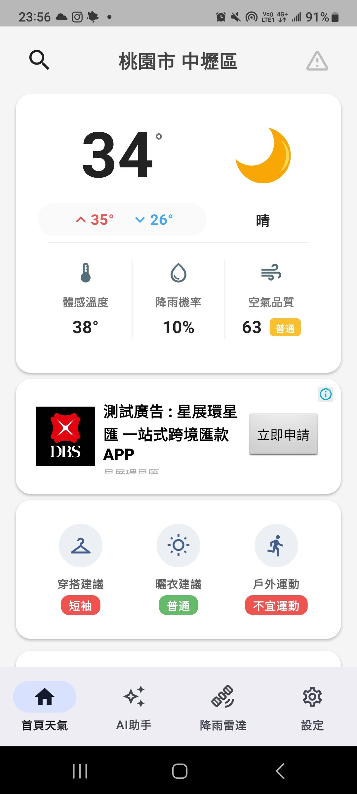
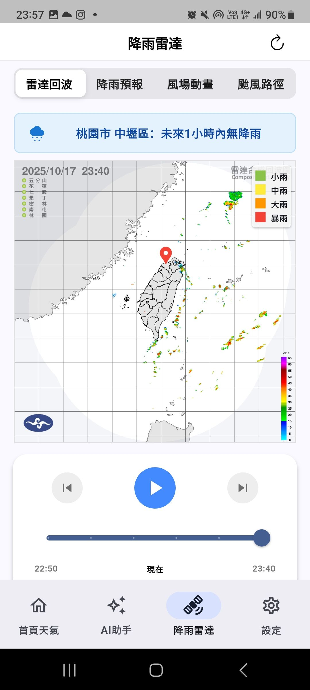
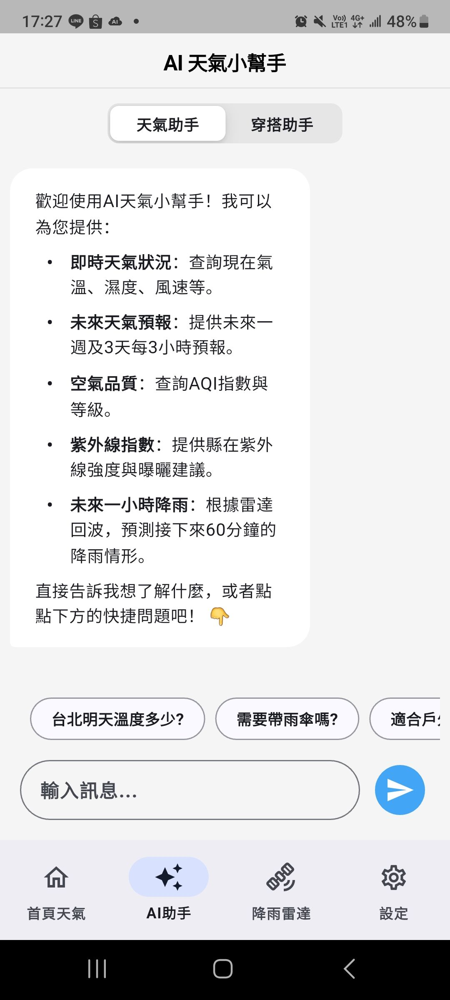
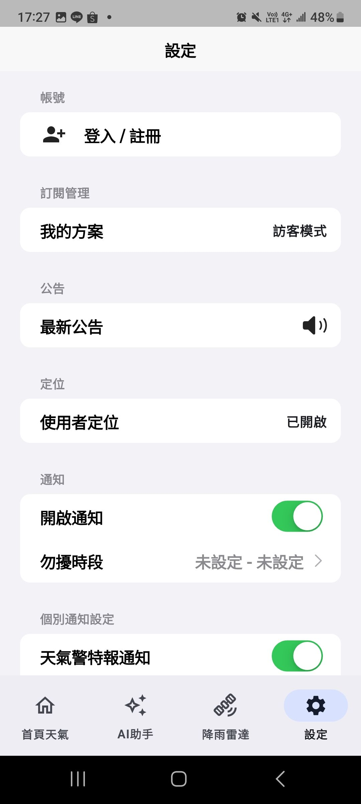

# My Flutter Weather & AI Assistant App

## Project Overview

This is a comprehensive Flutter application designed to provide users with real-time weather forecasts, advanced weather radar visualizations, and an intelligent AI assistant. The application leverages Firebase as its backend for data storage and other cloud services, ensuring a robust and scalable solution.

## Key Features

*   **Detailed Weather Forecasts:** Current, hourly, and weekly forecasts with various indices.
*   **Interactive Weather Radar:** Visualizes weather patterns with multiple map layers and AI analysis.
*   **Intelligent AI Assistant:** Provides personalized advice, including clothing recommendations and weather insights.
*   **Secure Authentication:** Supports sign-in with Google and Apple, with robust security measures.
*   **Background Notifications:** Proactively alerts users to important weather events.

## UI Screenshots

| Home Screen | Radar | AI Assistant | Settings |
| :---: | :---: | :---: | :---: |
|  |  |  |  |

## Architecture & Technical Stack

*   **Architecture**: Built with a feature-first, layered architecture (Presentation, Domain, Data) to ensure modularity and maintainability.
*   **State Management**: Utilizes the BLoC (Business Logic Component) pattern for predictable and scalable state management across the app.
*   **Firebase Backend**: Deeply integrated with Firebase for a comprehensive backend solution:
    *   **Authentication**: For secure user sign-in.
    *   **Firestore & Realtime Database**: For real-time data storage and managing usage counters.
    *   **Vertex AI (Gemini)**: Powers the intelligent AI assistant features.
    *   **Remote Config**: For dynamic app configuration.
    *   **Crashlytics & Analytics**: For robust crash reporting and user engagement tracking.

## Security Features

*   **Runtime Application Self-Protection (RASP)**: Implemented using `freerasp` to protect the application against threats like debugging, reverse engineering, and running on compromised (rooted/jailbroken) devices.
*   **Backend Protection**: Leverages `Firebase App Check` to ensure that only authenticated and unmodified instances of the app can access backend resources.

## Background Tasks & Notifications

*   **Intelligent Background Tasks**: Uses `workmanager` to schedule periodic background tasks, such as checking for evening forecasts and imminent rain alerts.
*   **Proactive Notifications**: Delivers timely local notifications to users about important weather events, powered by `flutter_local_notifications`.

## Project Structure

The project is organized using a feature-first approach. Below is an overview of the `lib` directory, which is the core of the application.

```
lib
├── background_tasks
│   ├── evening_forecast_task_handler.dart
│   ├── fcm_background_handler.dart
│   ├── imminent_rain_task_handler.dart
│   └── weather_alert_task_handler.dart
├── features
│   ├── ai_assistant
│   │   ├── assets
│   │   ├── data
│   │   ├── domain
│   │   └── presentation
│   ├── location
│   │   ├── data
│   │   ├── domain
│   │   └── presentation
│   ├── radar
│   │   ├── data
│   │   ├── presentation
│   │   └── utils
│   ├── settings
│   │   ├── domain
│   │   ├── screens
│   │   ├── utils
│   │   └── widgets
│   └── weather
│       ├── data
│       ├── domain
│       └── presentation
├── firebase_options.dart
├── main.dart
├── models
├── screens
├── services
├── state
├── utils
└── widgets
```

## Continuous Integration (CI)

This project uses **GitHub Actions** to automate quality assurance. The CI workflow is defined in `.github/workflows/ci.yml`:

1.  **Code Checkout**: Downloads the latest version of the code.
2.  **Setup Flutter**: Installs the correct Flutter SDK version (beta channel) to match the project's environment.
3.  **Install Dependencies**: Runs `flutter pub get` to ensure all packages are available.
4.  **Static Analysis**: Executes `flutter analyze` with strict rules (`--fatal-infos`, `--fatal-warnings`) to enforce high code quality and style consistency. Any linting error will cause the pipeline to fail.
5.  **Run Tests**: Runs all automated tests via `flutter test`. Any test failure will cause the pipeline to fail.

This automated process ensures that only code that meets our quality and correctness standards, maintaining the stability of the project.

## License

This is a proprietary software. All rights are reserved.
